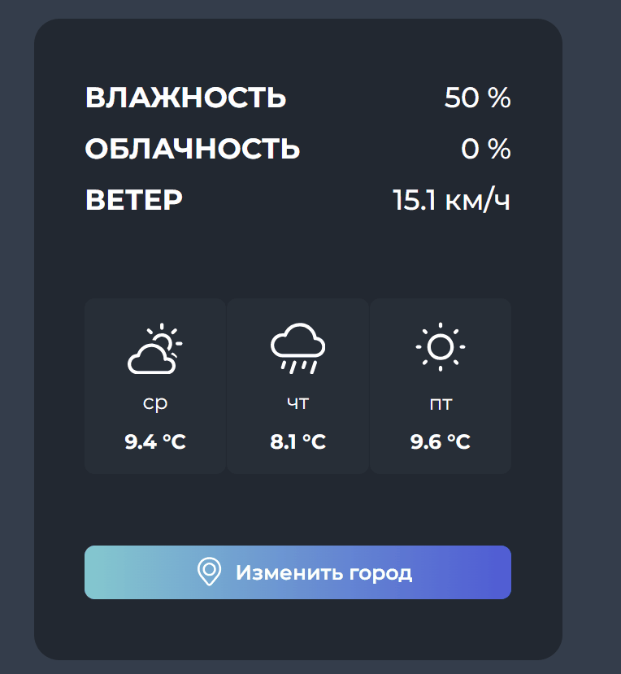

В процессе

# 🌤️ Weather Vue App

Веб-приложение для просмотра погоды с красивым интерфейсом, построенное на Vue.js. Получайте актуальную информацию о погоде в любом городе мира.

## Демо

## Возможности

- **Поиск по городу**
- **Прогноз на 3 дня**
- **Детальная информация**

## Технологии

- **Frontend:** Vue.js 3, CSS3, HTML5
- **API:** [WeatherAPI.com](https://www.weatherapi.com/)
- **Инструменты:** Vue CLI, npm/yarn
